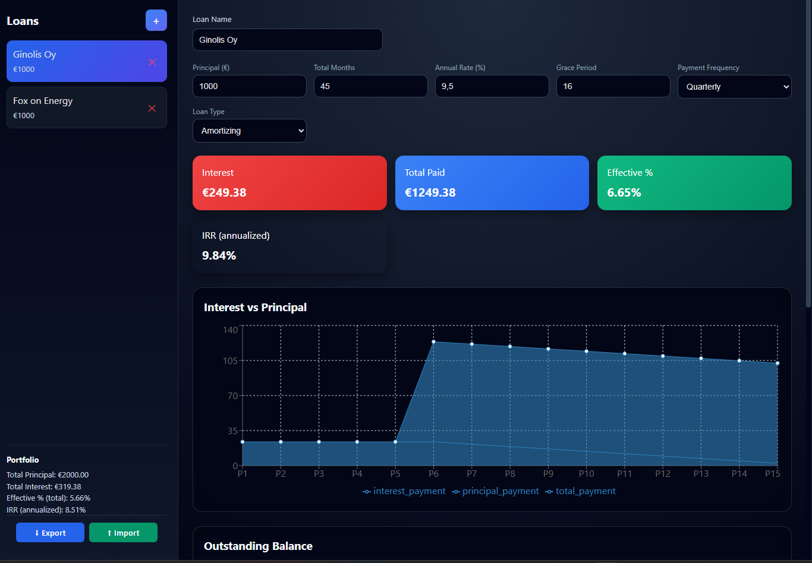
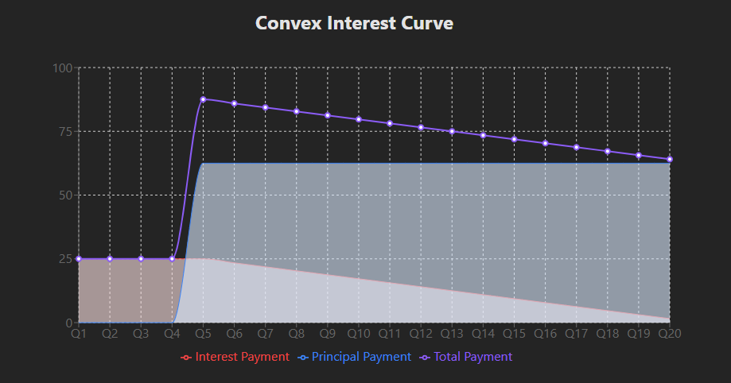
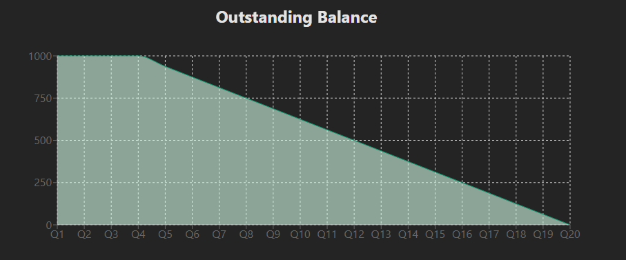
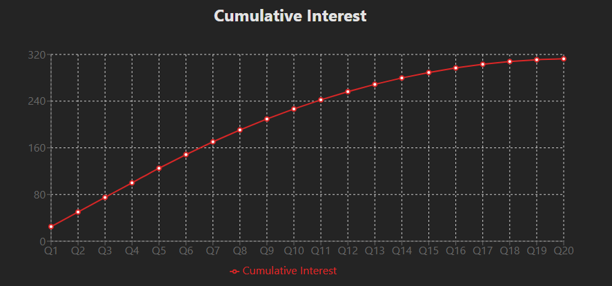

This calculates the "Equal Principal Installment Loan with Deferred Amortization"
The script could be sensitive to some floating point numbers, so eventual calculations might be off by a couple cents

Contains
- main.py with a simple cli tool for calculating the key financial numbers (kerngetallen)
- react app with a simple 'LoanVisualization' component that you can run with ```npm install``` and then ```npm run dev```. 
  - I used node 20.19.4 and npm 10.8.2 🤷‍♂️🤷
  - Local:   http://localhost:5173/

 (v0.2)
--------------------------




